<!-- BANNER - generated by scripts/banner.py from assets/profile.json -->
<picture>
  <source media="(prefers-color-scheme: dark)"  srcset="assets/banner-dark.svg">
  <source media="(prefers-color-scheme: light)" srcset="assets/banner-light.svg">
  
</picture>

 

<!-- NAME / TAGLINE - animated typing -->

 

<!-- SOCIALS - add your LinkedIn / e-mail by uncommenting and filling in the lines below -->
&nbsp;&nbsp;
<!-- &nbsp;&nbsp; -->
<!--  -->

 

---

## whoami

Hi, I'm **Seifeddine**, a Computer Science student at **Heinrich-Heine-Universität Düsseldorf** 🇩🇪 (B.Sc. Informatik, since 2024),
after starting out in computer engineering at **INSAT** in Tunis 🇹🇳. I like building solid backends and teaching machines to read between the lines.

- 💼 **Werkstudent - Data Migration Analyst at [Stepstone](https://www.stepstone.de)** (since March 2026): reconciling customer data across systems, fixing broken records and keeping data quality high.
- ☕ **Full-stack with Java & Spring Boot + React**: a laundry booking system for my student residence with auth, live machine status and slot booking ([Waschsalon](https://github.com/seifeddine2003/Waschsalon)), and a REST + MySQL backend ([SpringShopAnalytics](https://github.com/seifeddine2003/SpringShopAnalytics)).
- 🤖 **NLP with PyTorch & HuggingFace**: compared five models for [fake news detection](https://github.com/seifeddine2003/fake_news_detection), reaching **98.63% accuracy** with fine-tuned DistilBERT.
- 💬 Built an **AI chatbot**: JavaScript frontend wired to the OpenAI API through **n8n** workflows.
- 🌍 Speaks **Arabic, German, English** and some **French**.
- 🥊 Off the keyboard: football, boxing, running, fitness and music of every genre.

 

## my stack`

---

## signals

<table>
<tr>
<td width="50%" align="center" valign="middle">

<!-- Self-rated skill radar - edit assets/skills.json, the workflow redraws it -->
<picture>
  <source media="(prefers-color-scheme: dark)"  srcset="assets/radar-dark.svg">
  <source media="(prefers-color-scheme: light)" srcset="assets/radar-light.svg">
  
</picture>

</td>
<td width="50%" align="center" valign="middle">

<!-- Language radar - edit assets/languages.json -->
<picture>
  <source media="(prefers-color-scheme: dark)"  srcset="assets/radar-langs-dark.svg">
  <source media="(prefers-color-scheme: light)" srcset="assets/radar-langs-light.svg">
  
</picture>

</td>
</tr>
</table>

---

## featured builds

<table>
<tr>
<td align="center">
<a href="https://github.com/seifeddine2003/fake_news_detection">
<picture>
  <source media="(prefers-color-scheme: dark)"  srcset="assets/card-fake_news_detection-dark.svg">
  <source media="(prefers-color-scheme: light)" srcset="assets/card-fake_news_detection-light.svg">
  
</picture>
</a>
</td>
<td align="center">
<a href="https://github.com/seifeddine2003/Waschsalon">
<picture>
  <source media="(prefers-color-scheme: dark)"  srcset="assets/card-Waschsalon-dark.svg">
  <source media="(prefers-color-scheme: light)" srcset="assets/card-Waschsalon-light.svg">
  
</picture>
</a>
</td>
</tr>
<tr>
<td align="center">
<a href="https://github.com/seifeddine2003/SpringShopAnalytics">
<picture>
  <source media="(prefers-color-scheme: dark)"  srcset="assets/card-SpringShopAnalytics-dark.svg">
  <source media="(prefers-color-scheme: light)" srcset="assets/card-SpringShopAnalytics-light.svg">
  
</picture>
</a>
</td>
<td align="center">
<a href="https://github.com/seifeddine2003/Fitness-website">
<picture>
  <source media="(prefers-color-scheme: dark)"  srcset="assets/card-Fitness-website-dark.svg">
  <source media="(prefers-color-scheme: light)" srcset="assets/card-Fitness-website-light.svg">
  
</picture>
</a>
</td>
</tr>
</table>

---

## numbers? oh yes.

<!-- Generated by scripts/cards.py (self-hosted, no third-party stats service) -->
<picture>
  <source media="(prefers-color-scheme: dark)"  srcset="assets/card-stats-dark.svg">
  <source media="(prefers-color-scheme: light)" srcset="assets/card-stats-light.svg">
  
</picture>

 

<picture>
  <source media="(prefers-color-scheme: dark)"  srcset="assets/card-langs-dark.svg">
  <source media="(prefers-color-scheme: light)" srcset="assets/card-langs-light.svg">
  
</picture>

---

` built with curiosity · @seifeddine2003 `

